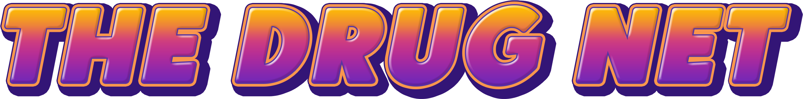

The Drug Net: Easily Distributed Chemical Data for Everyone!
============================================================

  

With the rise of chemical data being digitally recorded motivates the need for a hub for centralized data that is 
easily accessible. In this talk, I present `The Drug Net` a python package that is utilizing pandas and pickling for 
cleaning and compression of data to be distributed through PyPi.

Announcements
=============

Using The Drug Net
==================

Installation 
==================

Development Installation
========================

As of right now, the drug net is under heavy development at this time, we highly
recommend developers to use the development version on Github (master
branch). You need to clone the repository and install cocktail-shaker with

`python setup.py install`.

As a one-liner, assuming git is installed:

    git clone https://github.com/Sulstice/the-drug-net.git

This will automatically install the latest version of the drug net.

Structure of the drug net
==========================

Currently, the main subpackages are:

thedrugnet 
databases 

Genesis
=======

cocktail-shaker began when one developer/scientist wanted an open source
drug library.

- Lead Developer [Suliman sharif](http://sulstice.github.io/)
- Artwork [Elena Chow](http://www.chowelena.com/)

Now the drug net looks to build on the expertise of these
developers/scientists and the broader open-science community to build an
effective drug library.

* * * * *

External links
==============

-   [Documentation]()

